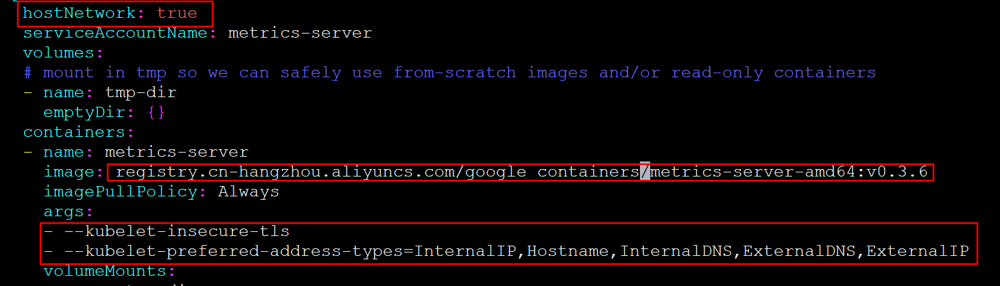

# Kubernetes 实用篇

## 目录

### 1.1 k8s是什么？

kubernetes，是一个全新的基于容器技术的分布式架构领先方案，是谷歌严格保密十几年的秘密武器----Borg系统的一个开源版本，于2014年9月发布第一个版本，2015年7月发布第一个正式版本。

kubernetes的本质是**一组服务器集群**，它可以在集群的每个节点上运行特定的程序，来对节点中的容器进行管理。目的是实现资源管理的自动化，主要提供了如下的主要功能：

*   **自我修复**：一旦某一个容器崩溃，能够在1秒中左右迅速启动新的容器

*   **弹性伸缩**：可以根据需要，自动对集群中正在运行的容器数量进行调整

*   **服务发现**：服务可以通过自动发现的形式找到它所依赖的服务

*   **负载均衡**：如果一个服务起动了多个容器，能够自动实现请求的负载均衡

*   **版本回退**：如果发现新发布的程序版本有问题，可以立即回退到原来的版本

*   **存储编排**：可以根据容器自身的需求自动创建存储卷


### 2.1 k8s解决了什么？

在部署应用程序的方式上，主要经历了三个时代：

*   **传统部署**：互联网早期，会直接将应用程序部署在物理机上

    > 优点：简单，不需要其它技术的参与 缺点：不能为应用程序定义资源使用边界，程序之间容易产生影响

*   **虚拟化部署**：可以在一台物理机上运行多个虚拟机，每个虚拟机都是独立操作系统

    > 优点：程序环境不会相互产生影响，提供了一定程度的安全性 &#x20;
    > &#x20;   缺点：增加了操作系统，浪费了部分资源

*   **容器化部署**：与虚拟化类似，但是共享了操作系统

    > 优点：可以保证每个容器拥有自己的文件系统、CPU、内存、进程空间等，运行应用程序所需要的资源都被容器包装，并和底层基础架构解耦。 容器化的应用程序可以跨云服务商、跨Linux操作系统发行版进行部署

    

容器化部署方式给带来很多的便利，但是也会出现一些问题，比如说：

*   一个容器故障停机了，怎么样让另外一个容器立刻启动去替补停机的容器

*   当并发访问量变大的时候，怎么样做到横向扩展容器数量

这些容器管理的问题统称为**容器编排**问题，为了解决这些容器编排问题，就产生了一些容器编排的软件：

*   **Swarm**：Docker自己的容器编排工具

*   **Mesos**：Apache的一个资源统一管控的工具，需要和Marathon结合使用

*   **Kubernetes**：Google开源的的容器编排工具


### 3.1 k8s基本原理是什么？

#### 1）整体说明

一个kubernetes集群主要是由**控制节点(master)**、\*\*工作节点(node) \*\*构成，每个节点上都会安装不同的组件。


**master：集群的控制平面，负责集群的决策 ( 管理 )**

> **ApiServer** : 资源操作的唯一入口，接收用户输入的命令，提供认证、授权、API注册和发现等机制

**Scheduler** : 负责集群资源调度，按照预定的调度策略将Pod调度到相应的node节点上

**ControllerManager** : 负责维护集群的状态，比如程序部署安排、故障检测、自动扩展、滚动更新等

**Etcd** ：负责存储集群中各种资源对象的信息

**node：集群的数据平面，负责为容器提供运行环境 ( 干活 )**

> **Kubelet** : 负责维护容器的生命周期，即通过控制docker，来创建、更新、销毁容器

**KubeProxy** : 负责提供集群内部的服务发现和负载均衡

**Docker** : 负责节点上容器的各种操作

下面，以部署一个nginx服务来说明kubernetes系统各个组件调用关系：


1.  首先要明确，一旦kubernetes环境启动之后，master和node都会将自身的信息存储到etcd数据库中

2.  一个nginx服务的安装请求会首先被发送到master节点的apiServer组件

3.  apiServer组件会调用scheduler组件来决定到底应该把这个服务安装到哪个node节点上

    在此时，它会从etcd中读取各个node节点的信息，然后按照一定的算法进行选择，并将结果告知apiServer

4.  apiServer调用controller-manager去调度Node节点安装nginx服务

5.  kubelet接收到指令后，会通知docker，然后由docker来启动一个nginx的pod

    pod是kubernetes的最小操作单元，容器必须跑在pod中至此，

6.  一个nginx服务就运行了，如果需要访问nginx，就需要通过kube-proxy来对pod产生访问的代理

这样，外界用户就可以访问集群中的nginx服务了

#### 2）组件的整体说明：

**Master**：集群控制节点，每个集群需要至少一个master节点负责集群的管控

**Node**：工作负载节点，由master分配容器到这些node工作节点上，然后node节点上的docker负责容器的运行

**Pod**：kubernetes的最小控制单元，容器都是运行在pod中的，一个pod中可以有1个或者多个容器

**Controller**：控制器，通过它来实现对pod的管理，比如启动pod、停止pod、伸缩pod的数量等等

**Service**：pod对外服务的统一入口，下面可以维护者同一类的多个pod

**Label**：标签，用于对pod进行分类，同一类pod会拥有相同的标签

**NameSpace**：命名空间，用来隔离pod的运行环境

#### 3）Pod间的通信


### 4.1 k8s如何学？

#### 1）环境的搭建

—1—

**搭建虚拟机**

[下载镜像](http://mirrors.ustc.edu.cn/centos/7.9.2009/isos/x86_64/CentOS-7-x86_64-Minimal-2009.iso "下载镜像") > [安装虚拟机（三台：k8s-master、k8s-node01、k8s-node02）](https://cdn.jsdelivr.net/gh/18476305640/typora@master/image/16460272220511646027221153.png "安装虚拟机（三台：k8s-master、k8s-node01、k8s-node02）")> [并设置虚拟主机ip为静态ip](https://cdn.jsdelivr.net/gh/18476305640/typora@master/image/16460273585281646027358429.png "并设置虚拟主机ip为静态ip")

> k8s-master01\@192.168.109.100、k8s-node01\@192.168.109.101、k8s-node02\@192.168.109.102

—2—

**必须环境 （全节点）**

```text
yum install vim wget -y    #安装必要软件
cat /etc/redhat-release   #查看版本，版本不要小于Centos Linux 7.5.1804 (Core) 这个版本
cat <<EOF >> /etc/hosts   # 主机名成解析 编辑三台服务器的/etc/hosts文件，添加下面内容
192.168.109.100 k8s-master
192.168.109.101 k8s-node01
192.168.109.102 k8s-node02
EOF
#kubernetes要求集群中的节点时间必须精确一直，这里使用chronyd服务从网络同步时间
systemctl start chronyd
systemctl enable chronyd
yum install ntpdate -y
ntpdate ntp.aliyun.com
date
# 1 关闭firewalld服务
systemctl stop firewalld
systemctl disable firewalld
# 2 关闭iptables服务
systemctl stop iptables
systemctl disable iptables
#  禁用selinux：编辑 /etc/selinux/config 文件，修改SELINUX的值为disable
sed -i '/SELINUX/s/enforcing/disable/g' /etc/selinux/config
#禁用swap：编辑分区配置文件/etc/fstab，注释掉swap分区一行
sed -i '/swap/s/^\//\#\//' /etc/fstab
swapoff -a  #临时关闭，否则master初始化报错
#修改linux的内核参数
# 修改linux的内核采纳数，添加网桥过滤和地址转发功能
# 编辑/etc/sysctl.d/kubernetes.conf文件，添加如下配置：
cat <<EOF > /etc/sysctl.d/kubernetes.conf
net.bridge.bridge-nf-call-ip6tables = 1
net.bridge.bridge-nf-call-iptables = 1
net.ipv4.ip_forward = 1
EOF
sysctl -p  #重新加载
modprobe br_netfilter  # 加载网桥过滤模块
lsmod | grep br_netfilter  # 查看网桥过滤模块是否加载成功
# 1.安装ipset和ipvsadm
yum install ipset ipvsadmin -y
# 2.添加需要加载的模块写入脚本文件
cat <<EOF> /etc/sysconfig/modules/ipvs.modules
#!/bin/bash
modprobe -- ip_vs
modprobe -- ip_vs_rr
modprobe -- ip_vs_wrr
modprobe -- ip_vs_sh
modprobe -- nf_conntrack_ipv4
EOF
# 3.为脚本添加执行权限
chmod +x /etc/sysconfig/modules/ipvs.modules
# 4.执行脚本文件
/bin/bash /etc/sysconfig/modules/ipvs.modules
# 5.查看对应的模块是否加载成功
lsmod | grep -e ip_vs -e nf_conntrack_ipv4

```

**—3—**

**安装Docker （全节点）**

```text
# 1、切换镜像源
wget https://mirrors.aliyun.com/docker-ce/linux/centos/docker-ce.repo -O /etc/yum.repos.d/docker-ce.repo
# 2、查看当前镜像源中支持的docker版本
yum list docker-ce --showduplicates
# 3、安装特定版本的docker-ce
# 必须制定--setopt=obsoletes=0，否则yum会自动安装更高版本
yum install --setopt=obsoletes=0 docker-ce-18.06.3.ce-3.el7 -y
# 4、添加一个配置文件
#Docker 在默认情况下使用Vgroup Driver为cgroupfs，而Kubernetes推荐使用systemd来替代cgroupfs
mkdir /etc/docker
cat <<EOF> /etc/docker/daemon.json
{
  "exec-opts": ["native.cgroupdriver=systemd"],
  "registry-mirrors": ["https://kn0t2bca.mirror.aliyuncs.com"]
}
EOF
#启动&设置自启动docker
systemctl restart docker
systemctl enable docker

```

**—4—**

**安装k8s （全节点）**

```text
# 1、由于kubernetes的镜像在国外，速度比较慢，这里切换成国内的镜像源
cat <<EOF > /etc/yum.repos.d/kubernetes.repo
[kubernetes]
name=Kubernetes
baseurl=http://mirrors.aliyun.com/kubernetes/yum/repos/kubernetes-el7-x86_64
enabled=1
gpgcheck=0
repo_gpgcheck=0
gpgkey=http://mirrors.aliyun.com/kubernetes/yum/doc/yum-key.gpg
       http://mirrors.aliyun.com/kubernetes/yum/doc/rpm-package-key.gpg
EOF
yum install --setopt=obsoletes=0 kubeadm-1.17.4-0 kubelet-1.17.4-0 kubectl-1.17.4-0 -y
#编辑/etc/sysconfig/kubelet, 添加下面的配置
cat <<EOF >> /etc/sysconfig/kubelet
KUBELET_CGROUP_ARGS="--cgroup-driver=systemd"
KUBE_PROXY_MODE="ipvs"
EOF
# 5、设置kubelet开机自启
systemctl enable kubelet

```

**这是卸载！**

**这是卸载！**

**这是卸载！**！！，别安装就卸载了！！

```bash
#这是卸载k8s的命令
kubeadm reset -f
modprobe -r ipip
lsmod
rm -rf ~/.kube/
rm -rf /etc/kubernetes/
rm -rf /etc/systemd/system/kubelet.service.d
rm -rf /etc/systemd/system/kubelet.service
rm -rf /usr/bin/kube*
rm -rf /etc/cni
rm -rf /opt/cni
rm -rf /var/lib/etcd
rm -rf /var/etcd
yum clean all
yum remove kube*
```

**—5—**

**master节点的初始化 （master节点）**

查看开机是否自动连接网络：

nmtui  #进入网络配置


reboot  #将主机重启，然后 >>

*   master的初始化：

```bash
# 在安装kubernetes集群之前，必须要提前准备好集群需要的镜像，所需镜像可以通过下面命令查看
kubeadm config images list

# 下载镜像
# 此镜像kubernetes的仓库中，由于网络原因，无法连接，下面提供了一种替换方案
images=(
  kube-apiserver:v1.17.4
  kube-controller-manager:v1.17.4
  kube-scheduler:v1.17.4
  kube-proxy:v1.17.4
  pause:3.1
  etcd:3.4.3-0
  coredns:1.6.5
)

for imageName in ${images[@]};do
  docker pull registry.cn-hangzhou.aliyuncs.com/google_containers/$imageName
  docker tag registry.cn-hangzhou.aliyuncs.com/google_containers/$imageName k8s.gcr.io/$imageName
  docker rmi registry.cn-hangzhou.aliyuncs.com/google_containers/$imageName 
done

#查看下载好的镜像
docker images
#开始初始化
kubeadm init \
  --apiserver-advertise-address=192.168.109.100 \
  --kubernetes-version=v1.17.4 \
  --service-cidr=10.96.0.0/12 \
  --pod-network-cidr=10.244.0.0/16 
#初始化 ，本质就是安装需要的组件的过程（可能要修改两处，版本与192.168.87.101）,特别感谢:https://blog.csdn.net/weixin_41831919/article/details/119790356
#初始化失败？ 运行：
# kubeadm reset 
# rm -rf $HOME/.kube/config  & rm -rf $HOME/.kube; 
# rm -rf /etc/cni/net.d   & ipvsadm --clear  
#再执行初始化命令 

```

*   初始化完成后的输出需要保存：

```bash
Your Kubernetes control-plane has initialized successfully!

To start using your cluster, you need to run the following as a regular user:

  mkdir -p $HOME/.kube
  sudo cp -i /etc/kubernetes/admin.conf $HOME/.kube/config
  sudo chown $(id -u):$(id -g) $HOME/.kube/config

You should now deploy a pod network to the cluster.
Run "kubectl apply -f [podnetwork].yaml" with one of the options listed at:
  https://kubernetes.io/docs/concepts/cluster-administration/addons/

Then you can join any number of worker nodes by running the following on each as root:

kubeadm join 192.168.109.100:6443 --token fdfhpj.3pb3f3b2a0tzl68s \
    --discovery-token-ca-cert-hash sha256:cd7c2b09cf97a1f0083c4463fc51de07957561c43bb99068e89dd658114940a8
    
    
#重新生成
# kubeadm token create
424mp7.nkxx07p940mkl2nd
# openssl x509 -pubkey -in /etc/kubernetes/pki/ca.crt | openssl rsa -pubin -outform der 2>/dev/null | openssl dgst -sha256 -hex | sed 's/^.* //'
d88fb55cb1bd659023b11e61052b39bbfe99842b0636574a16c76df186fd5e0d
```

**—6—**

**master机器，执行上面输出的“三行命令”，让master机器可以操作k8s集群：**

```bash
  mkdir -p $HOME/.kube
  sudo cp -i /etc/kubernetes/admin.conf $HOME/.kube/config
  sudo chown $(id -u):$(id -g) $HOME/.kube/config
```

**—7—**

**node节点注册到master**

```bash
#注意其它节点加进来，需要拉取上面的组件，再注册进来。
images=(
  kube-apiserver:v1.17.4
  kube-controller-manager:v1.17.4
  kube-scheduler:v1.17.4
  kube-proxy:v1.17.4
  pause:3.1
  etcd:3.4.3-0
  coredns:1.6.5
)

for imageName in ${images[@]};do
  docker pull registry.cn-hangzhou.aliyuncs.com/google_containers/$imageName
  docker tag registry.cn-hangzhou.aliyuncs.com/google_containers/$imageName k8s.gcr.io/$imageName
  docker rmi registry.cn-hangzhou.aliyuncs.com/google_containers/$imageName 
done

#然后使用上面的链接注册进来，如果想要在node节点上操作集群，需要执行初始化后的那三个命令
kubeadm join 192.168.109.100:6443 --token fdfhpj.3pb3f3b2a0tzl68s \
    --discovery-token-ca-cert-hash sha256:cd7c2b09cf97a1f0083c4463fc51de07957561c43bb99068e89dd658114940a8

```

**—8—**

**安装网络插件**

网络插件，也是pod,  解决NoReady 是因为网络插件还没有安装


```bash
kubectl apply -f https://raw.githubusercontent.com/coreos/flannel/master/Documentation/kube-flannel.yml
##删除插件 kubectl delete -f https://raw.githubusercontent.com/coreos/flannel/master/Documentation/kube-flannel.yml
# kubeadm reset  重置集群环境  
# 参考：https:/blog.csdn.net/qq_43158436/article/details/108583757
# master 重置环境时要删除一些东西  https://blog.csdn.net/woay2008/article/details/93250137
# 重新启动 tgsystemctl restart kubelet
# 参考： https://blog.csdn.net/qq_41813208/article/details/108625419       
```

#### 2）操作前扫盲

我们操作集群，都是操作集群中的资源，即对资源进行“增删改查”，以下是我们学习的重点资源：

| 资源分类       | 资源名称                     | 缩写     | 资源作用      |
| ---------- | ------------------------ | ------ | --------- |
| 集群级别资源     | nodes                    | no     | 集群组成部分    |
| namespaces | ns                       | 隔离Pod  |           |
| pod资源      | pods                     | po     | 装载容器      |
| pod资源控制器   | replicationcontrollers   | rc     | 控制pod资源   |
|            | replicasets              | rs     | 控制pod资源   |
|            | deployments              | deploy | 控制pod资源   |
|            | daemonsets               | ds     | 控制pod资源   |
|            | jobs                     |        | 控制pod资源   |
|            | cronjobs                 | cj     | 控制pod资源   |
|            | horizontalpodautoscalers | hpa    | 控制pod资源   |
|            | statefulsets             | sts    | 控制pod资源   |
| 服务发现资源     | services                 | svc    | 统一pod对外接口 |
|            | ingress                  | ing    | 统一pod对外接口 |
| 存储资源       | volumeattachments        |        | 存储        |
|            | persistentvolumes        | pv     | 存储        |
|            | persistentvolumeclaims   | pvc    | 存储        |
| 配置资源       | configmaps               | cm     | 配置        |
|            | secrets                  |        | 配置        |

> 精辟：我知道上面你是不会认真看的，所以我简要说一下，namespace简称ns，用来隔离pod，比如生产环境pro，与开发环境的dev，你就可以设置这两个ns，又比如k8s在初始化时安装的系统组件，就放在了"kube-system" ns上。 pod就像我们主机一样，pod就是容器（应用,比如nginx），比如我们在pod上部署了两个程序，nginx与tomcat，那么我们就可以在集群上通过pod的ip+程序端口 进行访问了。 deployment简称deploy，比如有几个nginx程序,他们是可以互相替换的，就像银行的窗口，窗口1可以取钱，窗口2也可以，人多了我们可以开多个窗口，人少了就关掉一些窗口，怎么控制呢这一组相同的pod呢，那就需要deploy了，怎么知道deploy要管理哪些pod呢，我们可以在创建pod时指定标签, 而创新deploy时指定要管理哪些标签，注意这些标签是可以有多个的。deploy可以管理pod，当pod宕机，超过pod给定的资源时deploy就会进行重启等操作，即让pod迅速达到期望的值。所以在实际中，我们比较少直接创建一个pod，而是让deploy进行创建，即我们在创新deploy时指定要管理的标签，pod的模板，pod的期望个数等参数，创建后，deploy看管理的pod是0个，那么它马上按指定的pod模板进行创建出期望的个数，deploy的功能还不止于此，我们可以配置deploy，当有大量的请求使pod指定的cpu或内存占用超过指定的值时，就会进行自动创建，来分配压力，当然你可以指定最多的pod个数，当过了高峰时，deploy不会当时就杀掉我们之前多创建出来的pod，而是过了一段时间后，以免返峰。service简称svc，我们在学习k8s时最想不开的是这么多pod是如何让外面访问的了，其实很简单，只要我们向外界暴露了管理pod的deploy不就行了嘛，而deploy让哪个pod去顶，那就需要我们配置了，通过配置后，deploy就以轮询的方式让pod去顶了, 当然轮询只是其中一种。

操作资源的方式以下几种：

*   命令式对象管理：直接使用命令去操作kubernetes资源，简单操作使用这个就很方便，但是用来创建资源是推荐的。

```bash
kubectl run nginx-pod --image=nginx:1.17.1 --port=80
```

*   对象配置：通过命令配置和配置文件去操作kubernetes资源

```bash
#是创建还是删除还是其它操作，自行指定
kubectl create/patch -f nginx-pod.yaml
#声明式，对存在的资源进行创建操作，对已存在的资源进行更新操作
kubectl apply -f nginx-pod.yaml
```

上面所说的配置文件，是用yaml的，因为yaml更注重它强调以数据为中心，并不是以标识语言为重点。

#### 3）kubectl命令

kubectl是kubernetes集群的命令行工具，通过它能够对集群本身进行管理，并能够在集群上进行容器化应用的安装部署。kubectl命令的语法如下：

```bash
kubectl [command] [type] [name] [flags]
```

**comand**：指定要对资源执行的操作，例如create、get、delete

**type**：指定资源类型，比如deployment、pod、service

**name**：指定资源的名称，名称大小写敏感

**flags**：指定额外的可选参数

```bash
kubectl get ns  #查看有哪些名称空间ns
kubectl create ns dev #创建一个名为dev的名称空间
kubectl get pod -n dev #查看ns为dev中的pod
kubectl get pod -n dev -o wide #查看更为详细的ns为dev中的pod信息
#在ns为dev的名称空间上创建一个名为nginx的pod，运行nginx:1.17.1 ，暴露80端口
kubectl run nginx --image=nginx:1.17.1 --port=80 -n dev
kubectl delete pod nginx -n dev  #删除ns为dev中名为nginx的pod
#在ns为dev的名称空间中创建一个deploy ,名为nginx，使用的image是nginx:1.17.1 , 有3个副本
kubectl create deploy nginx  --image=nginx:1.17.1  --replicas=3 -n dev
#暴露ns为dev的deploy名为nginx，暴露pod中的80，集群访问用80，而外部这里没有指定，是在一定的范围内生成一个作为访问端口
kubectl expose deploy nginx  --port=80 --target-port=80  --type=NodePort -n dev
#查看ns为dev的pod与svc资源
kubectl get pod,svc -n dev
#查看pod日记输出
kubectl logs  gateway-0  -c gateway  #加 -f 持续输出
#进入容器
kubectl exec -it gateway-0  -n default  /bin/sh
```

#### 4）使用配置文件的方式

我们需要通过写`yaml` 文件，来操作我们的资源，写好后我们可以：

kubectl apply -f  <文件名>.yaml &#x20;

kubectl create/delete -f  <文件名>.yaml &#x20;

来创建、更新、删除k8s资源。

那我们如何写配置文件呢？我们可以通过 `kubectl explain pod` 命令查看资源的配置项，还可以查看指定资源更详细的信息，比如`kubectl explain pod.spec...` 查看。

#### ——pod资源yaml

```yaml
apiVersion: v1     #必选，版本号，例如v1
kind: Pod       　 #必选，资源类型，例如 Pod
metadata:       　 #必选，元数据
  name: string     #必选，Pod名称
  namespace: string  #Pod所属的命名空间,默认为"default"
  labels:       　　  #自定义标签列表
    - name: string      　          
spec:  #必选，Pod中容器的详细定义
  containers:  #必选，Pod中容器列表
  - name: string   #必选，容器名称
    image: string  #必选，容器的镜像名称
    imagePullPolicy: [ Always|Never|IfNotPresent ]  #获取镜像的策略 
    command: [string]   #容器的启动命令列表，如不指定，使用打包时使用的启动命令
    args: [string]      #容器的启动命令参数列表
    workingDir: string  #容器的工作目录
    volumeMounts:       #挂载到容器内部的存储卷配置
    - name: string      #引用pod定义的共享存储卷的名称，需用volumes[]部分定义的的卷名
      mountPath: string #存储卷在容器内mount的绝对路径，应少于512字符
      readOnly: boolean #是否为只读模式
    ports: #需要暴露的端口库号列表
    - name: string        #端口的名称
      containerPort: int  #容器需要监听的端口号
      hostPort: int       #容器所在主机需要监听的端口号，默认与Container相同
      protocol: string    #端口协议，支持TCP和UDP，默认TCP
    env:   #容器运行前需设置的环境变量列表
    - name: string  #环境变量名称
      value: string #环境变量的值
    resources: #资源限制和请求的设置
      limits:  #资源限制的设置
        cpu: string     #Cpu的限制，单位为core数，将用于docker run --cpu-shares参数
        memory: string  #内存限制，单位可以为Mib/Gib，将用于docker run --memory参数
      requests: #资源请求的设置
        cpu: string    #Cpu请求，容器启动的初始可用数量
        memory: string #内存请求,容器启动的初始可用数量
    lifecycle: #生命周期钩子
        postStart: #容器启动后立即执行此钩子,如果执行失败,会根据重启策略进行重启
        preStop: #容器终止前执行此钩子,无论结果如何,容器都会终止
    livenessProbe:  #对Pod内各容器健康检查的设置，当探测无响应几次后将自动重启该容器
      exec:       　 #对Pod容器内检查方式设置为exec方式
        command: [string]  #exec方式需要制定的命令或脚本
      httpGet:       #对Pod内个容器健康检查方法设置为HttpGet，需要制定Path、port
        path: string
        port: number
        host: string
        scheme: string
        HttpHeaders:
        - name: string
          value: string
      tcpSocket:     #对Pod内个容器健康检查方式设置为tcpSocket方式
         port: number
       initialDelaySeconds: 0       #容器启动完成后首次探测的时间，单位为秒
       timeoutSeconds: 0    　　    #对容器健康检查探测等待响应的超时时间，单位秒，默认1秒
       periodSeconds: 0     　　    #对容器监控检查的定期探测时间设置，单位秒，默认10秒一次
       successThreshold: 0
       failureThreshold: 0
       securityContext:
         privileged: false
  restartPolicy: [Always | Never | OnFailure]  #Pod的重启策略
  nodeName: <string> #设置NodeName表示将该Pod调度到指定到名称的node节点上
  nodeSelector: obeject #设置NodeSelector表示将该Pod调度到包含这个label的node上
  imagePullSecrets: #Pull镜像时使用的secret名称，以key：secretkey格式指定
  - name: string
  hostNetwork: false   #是否使用主机网络模式，默认为false，如果设置为true，表示使用宿主机网络
  volumes:   #在该pod上定义共享存储卷列表
  - name: string    #共享存储卷名称 （volumes类型有很多种）
    emptyDir: {}       #类型为emtyDir的存储卷，与Pod同生命周期的一个临时目录。为空值
    hostPath: string   #类型为hostPath的存储卷，表示挂载Pod所在宿主机的目录
      path: string      　　        #Pod所在宿主机的目录，将被用于同期中mount的目录
    secret:       　　　#类型为secret的存储卷，挂载集群与定义的secret对象到容器内部
      scretname: string  
      items:     
      - key: string
        path: string
    configMap:         #类型为configMap的存储卷，挂载预定义的configMap对象到容器内部
      name: string
      items:
      - key: string
        path: string
```

常用模板：

```yaml
apiVersion: v1
kind: Pod
metadata:
  name: pod-imagepullpolicy
  namespace: dev
spec:
  nodeName: node1 # 指定调度到node1节点上，还有亲和性，这里不就不写出了
  initContainers: #初始化容器
  - name: test-mysql
    image: busybox:1.30
    command: ['sh', '-c', 'until ping 192.168.90.14 -c 1 ; do echo waiting for mysql...; sleep 2; done;']
  - name: test-redis
    image: busybox:1.30
    command: ['sh', '-c', 'until ping 192.168.90.15 -c 1 ; do echo waiting for reids...; sleep 2; done;'] 
  containers:
  - name: nginx
    image: nginx:1.17.1
    imagePullPolicy: Never # 用于设置镜像拉取策略
    ports: # 设置容器暴露的端口列表
    - name: nginx-port
      containerPort: 80
      protocol: TCP
    resources: # 资源配额
      limits:  # 限制资源（上限）
        cpu: "2" # CPU限制，单位是core数
        memory: "10Gi" # 内存限制,可以使用Gi、Mi、G、M等形式
      requests: # 请求资源（下限）
        cpu: "1"  # CPU限制，单位是core数
        memory: "10Mi"  # 内存限制
  - name: busybox
    image: busybox:1.30
    command: ["/bin/sh","-c","touch /tmp/hello.txt;while true;do /bin/echo $(date +%T) >> /tmp/hello.txt; sleep 3; done;"]
    env: # 设置环境变量列表
    - name: "username"
      value: "admin"
    - name: "password"
      value: "123456"
```

#### ——pod控制器yaml


pod控制器有是用来管理pod的，ReplicaSet简称RS也是控制器，Deployment简称deploy也是控制器。

**Deployment的资源清单文件：**

```yaml
apiVersion: apps/v1 # 版本号
kind: Deployment # 类型       
metadata: # 元数据
  name: # rs名称 
  namespace: # 所属命名空间 
  labels: #标签
    controller: deploy
spec: # 详情描述
  replicas: 3 # 副本数量
  revisionHistoryLimit: 3 # 保留历史版本
  paused: false # 暂停部署，默认是false
  progressDeadlineSeconds: 600 # 部署超时时间（s），默认是600
  strategy: # 策略
    type: RollingUpdate # 滚动更新策略
    rollingUpdate: # 滚动更新
      maxSurge: 30% # 最大额外可以存在的副本数，可以为百分比，也可以为整数
      maxUnavailable: 30% # 最大不可用状态的 Pod 的最大值，可以为百分比，也可以为整数
  selector: # 选择器，通过它指定该控制器管理哪些pod
    matchLabels:      # Labels匹配规则
      app: nginx-pod
    matchExpressions: # Expressions匹配规则
      - {key: app, operator: In, values: [nginx-pod]}
  template: # 模板，当副本数量不足时，会根据下面的模板创建pod副本
    metadata:
      labels:
        app: nginx-pod
    spec:
      containers:
      - name: nginx
        image: nginx:1.17.1
        ports:
        - containerPort: 80
```

常用模板：

```yaml
apiVersion: apps/v1
kind: Deployment      
metadata:
  name: pc-deployment
  namespace: dev
spec: 
  replicas: 3
  strategy: # 更新策略：重建更新、滚动更新（先更新一部分）
    type: RollingUpdate # 滚动更新策略
    rollingUpdate:
      maxSurge: 25% 
      maxUnavailable: 25%
  selector:
    matchLabels:
      app: nginx-pod
  template:
    metadata:
      labels:
        app: nginx-pod
    spec:
      containers:
      - name: nginx
        image: nginx:1.17.1
```

*   副本扩缩：kubectl edit deploy pc-deployment -n dev

*   版本更新：

```bash
#查看之前版本，可回退版本
kubectl rollout status deploy pc-deployment -n dev
#回退到指定版本  
kubectl rollout undo deployment pc-deployment --to-revision=1 -n dev
```

*   金丝雀发布&#x20;

属于滚动发布，就是在滚动发布未完成时就暂停的过程，观察能否稳定地按期望的方式运行。确定没问题之后再继续完成余下的Pod资源滚动更新，否则立即回滚更新操作。这就是所谓的金丝雀发布。

```bash
#升级到指定版本，然后立即暂停
kubectl set image deploy pc-deployment nginx=nginx:1.17.4 -n dev && kubectl rollout pause deployment pc-deployment  -n dev
#观察~
#继续更新
kubectl rollout resume deploy pc-deployment -n dev

```

*   \[重要] Horizontal Pod Autoscaler(HPA) 控制器


HPA可以获取每个Pod利用率，然后和HPA中定义的指标进行对比，同时计算出需要伸缩的具体值，最后实现Pod的数量的调整。

```bash
#安装metrics-server
yum install git -y
git clone -b v0.3.6 https://github.com/kubernetes-incubator/metrics-server
cd /root/metrics-server/deploy/1.8+/
vim metrics-server-deployment.yaml
#配置点：
hostNetwork: true
image: registry.cn-hangzhou.aliyuncs.com/google_containers/metrics-server-amd64:v0.3.6
args:
- --kubelet-insecure-tls
- --kubelet-preferred-address-types=InternalIP,Hostname,InternalDNS,ExternalDNS,ExternalIP

```



```bash
kubectl apply -f ./
#查看metrics-server 是否在运行
kubectl get pod -n kube-system
#查看node 占用资源
kubectl top node
#查看pod 占用资源
kubectl top pod -n kube-system
# 至此,metrics-server安装完成
  

```

vim hpa-nginx.yaml  &#x20;

> 创建指定的deploy的HPA, 下面的deploy为nginx，当cpu使用率超过3%时，就会创建pod副本，副本最多是10个，最少1个

```yaml
apiVersion: autoscaling/v1
kind: HorizontalPodAutoscaler
metadata:
  name: pc-hpa
  namespace: dev
spec:
  minReplicas: 1  #最小pod数量
  maxReplicas: 10 #最大pod数量
  targetCPUUtilizationPercentage: 3 # CPU使用率指标
  scaleTargetRef:   # 指定要控制的nginx信息
    apiVersion: apps/v1
    kind: Deployment
    name: nginx
```

kubectl create -f hpa-nginx.yaml &#x20;

测试：我们可以使用测压工具，如 `JMeter` 进行测试。

查看hpa上显示的资源占用：

kubectl get hpa -n dev -w

#### ——Service yaml

实现对pod的暴露。


模式：

*   userspace 模式：虽然比较稳定，但是效率比较低。

*   iptables 模式：较userspace模式效率更高，但不能提供灵活的LB策略，当后端Pod不可用时也无法进行重试。

*   ipvs 模式：ipvs相对iptables转发效率更高。除此以外，ipvs支持更多的LB算法。

开启ipvs模式：

```bash
# 此模式必须安装ipvs内核模块，否则会降级为iptables
# 开启ipvs
kubectl edit cm kube-proxy -n kube-system  ## 修改mode: "ipvs"
kubectl delete pod -l k8s-app=kube-proxy -n kube-system
ipvsadm -Ln   #当有规则信息时，说明生效了

```

Service 类型：

*   ClusterIP：默认值，只能在集群内部访问

*   NodePort：**就可以在集群外部访问服务**

*   LoadBalancer：使用外接负载均衡器完成到服务的负载分发，注意此模式需要外部云环境支持

*   ExternalName： 把集群外部的服务引入集群内部，直接使用

Service的yaml配置：&#x20;

```yaml
kind: Service  # 资源类型
apiVersion: v1  # 资源版本
metadata: # 元数据
  name: service # 资源名称
  namespace: dev # 命名空间
spec: # 描述
  selector: # 标签选择器，用于确定当前service代理哪些pod
    app: nginx
  type: # Service类型，指定service的访问方式
  clusterIP:  # 虚拟服务的ip地址
  sessionAffinity: # session亲和性，支持ClientIP、None两个选项
  ports: # 端口信息
    - protocol: TCP 
      port: 3017  # service端口
      targetPort: 5003 # pod端口
      nodePort: 31122 # 主机端口
```

**ClusterIP** 类型Service yaml配置：

```yaml
apiVersion: v1
kind: Service
metadata:
  name: service-clusterip
  namespace: dev
spec:
  selector:
    app: nginx-pod
  clusterIP: 10.97.97.97 # service的ip地址，如果不写，默认会生成一个
  type: ClusterIP
  ports:
  - port: 80  # Service端口       
    targetPort: 80 # pod端口
```

操作：

```bash
# 创建service
[root@k8s-master01 ~]# kubectl create -f service-clusterip.yaml
service/service-clusterip created

# 查看service
[root@k8s-master01 ~]# kubectl get svc -n dev -o wide
NAME                TYPE        CLUSTER-IP    EXTERNAL-IP   PORT(S)   AGE   SELECTOR
service-clusterip   ClusterIP   10.97.97.97   <none>        80/TCP    13s   app=nginx-pod
#我们可以通过上面的 10.97.97.97:80 在集群上访问了
```

\*\*NodePort \*\*类型 Service yaml配置：

```yaml
apiVersion: v1
kind: Service
metadata:
  name: service-nodeport
  namespace: dev
spec:
  selector:
    app: nginx-pod
  type: NodePort # service类型
  ports:
    - port: 80
      nodePort: 30002 # 指定绑定的node的端口(默认的取值范围是：30000-32767), 如果不指定，会默认分配
      targetPort: 80
```

我们就可以通过去访问集群中任意一个nodeip的30002端口，即可访问到pod。

#### 5）数据存储

#### ——基本存储

基本存储的类型

*   EmptyDir

*   HostPath

*   NFS：NFS是一个网络文件存储系统，可以搭建一台NFS服务器，然后将Pod中的存储直接连接到NFS系统上，这样的话，无论Pod在节点上怎么转移，只要Node跟NFS的对接没问题，数据就可以成功访问。


```bash
#首先要准备nfs的服务器，这里为了简单，直接是master节点做nfs服务器
#接下来是master节点的操作
yum install nfs-utils -y
mkdir /root/data/nfs -pv #准备一个共享目录
#将共享目录以读写权限暴露给192.168.5.0/24网段中的所有主机
vim /etc/exports #追加下面一行信息
/root/data/nfs     192.168.109.0/24(rw,no_root_squash)
systemctl restart nfs #启动nfs服务

#接下来是node节点操作
#接下来，要在的每个node节点上都安装下nfs，这样的目的是为了node节点可以驱动nfs设备
#在node上安装nfs服务，注意不需要启动
yum install nfs-utils -y


```

接下来，我们就可以创建pod，来使用nfs了, 即可以让pod 当作某个目录来使用，而文件保存在nfs的主机上。

```yaml
apiVersion: v1
kind: Pod
metadata:
  name: volume-nfs
  namespace: dev
spec:
  containers:
  - name: nginx
    image: nginx:1.17.1
    ports:
    - containerPort: 80
    volumeMounts:
    - name: logs-volume
      mountPath: /var/log/nginx
  - name: busybox
    image: busybox:1.30
    command: ["/bin/sh","-c","tail -f /logs/access.log"] 
    volumeMounts:
    - name: logs-volume
      mountPath: /logs
  volumes:
  - name: logs-volume
    nfs:
      server: 192.168.109.100  #nfs服务器地址
      path: /root/data/nfs #共享文件路径
```

#### ——高级存储

这里我们需要用到`基本存储`搭建的NFS服务器, 为了能够屏蔽底层存储实现的细节，方便用户使用， kubernetes引入PV和PVC两种资源对象。

*   PV（Persistent Volume）是持久化卷的意思，是对底层的共享存储的一种抽象。一般情况下PV由kubernetes管理员进行创建和配置，它与底层具体的共享存储技术有关，并通过插件完成与共享存储的对接。

    **状态（status）**

    一个 PV 的生命周期中，可能会处于4中不同的阶段：

    *   Available（可用）： 表示可用状态，还未被任何 PVC 绑定

    *   Bound（已绑定）： 表示 PV 已经被 PVC 绑定

    *   Released（已释放）： 表示 PVC 被删除，但是资源还未被集群重新声明

    *   Failed（失败）： 表示该 PV 的自动回收失败

*   PVC（Persistent Volume Claim）是资源的申请，用来声明对存储空间、访问模式、存储类别需求信息。


开始实验：

```bash
#创建三个目录，将创建三个pv分配使用
mkdir /root/data/{pv1,pv2,pv3} -pv
# 暴露
vim /etc/exports
/root/data/pv1     192.168.109.0/24(rw,no_root_squash)
/root/data/pv2     192.168.109.0/24(rw,no_root_squash)
/root/data/pv3     192.168.109.0/24(rw,no_root_squash)
# 重启服务
systemctl restart nfs
#开始创建三个pv
vim pv.yaml

```

pv.yaml：

```yaml
apiVersion: v1
kind: PersistentVolume
metadata:
  name:  pv1
spec:
  capacity: 
    storage: 1Gi
  accessModes:
  - ReadWriteMany
  persistentVolumeReclaimPolicy: Retain
  nfs:
    path: /root/data/pv1
    server: 192.168.109.100

---

apiVersion: v1
kind: PersistentVolume
metadata:
  name:  pv2
spec:
  capacity: 
    storage: 2Gi
  accessModes:
  - ReadWriteMany
  persistentVolumeReclaimPolicy: Retain
  nfs:
    path: /root/data/pv2
    server: 192.168.109.100
    
---

apiVersion: v1
kind: PersistentVolume
metadata:
  name:  pv3
spec:
  capacity: 
    storage: 3Gi
  accessModes:
  - ReadWriteMany
  persistentVolumeReclaimPolicy: Retain
  nfs:
    path: /root/data/pv3
    server: 192.168.109.100
```

```bash
#开始创建
kubectl create -f pv.yaml
#查看pv, 注意pv不属于”名称空间“中的资源
kubectl get pv -o wide
#准备创建pvc
vim pvc.yaml
```

pvc.yaml :&#x20;

```yaml
apiVersion: v1
kind: PersistentVolumeClaim
metadata:
  name: pvc1
  namespace: dev
spec:
  accessModes: 
  - ReadWriteMany
  resources:
    requests:
      storage: 1Gi
---
apiVersion: v1
kind: PersistentVolumeClaim
metadata:
  name: pvc2
  namespace: dev
spec:
  accessModes: 
  - ReadWriteMany
  resources:
    requests:
      storage: 1Gi
---
apiVersion: v1
kind: PersistentVolumeClaim
metadata:
  name: pvc3
  namespace: dev
spec:
  accessModes: 
  - ReadWriteMany
  resources:
    requests:
      storage: 1Gi
```

```bash
#开始创建
kubectl create -f pvc.yaml
#查看pvc
kubectl get pvc  -n dev -o wide
#pod使用pvc的示例
```

创建pod时使用pvc，示例：

```yaml
apiVersion: v1
kind: Pod
metadata:
  name: pod1
  namespace: dev
spec:
  containers:
  - name: busybox
    image: busybox:1.30
    command: ["/bin/sh","-c","while true;do echo pod1 >> /root/out.txt; sleep 10; done;"]
    volumeMounts:
    - name: volume
      mountPath: /root/
  volumes:
    - name: volume
      persistentVolumeClaim:
        claimName: pvc1
        readOnly: false
---
apiVersion: v1
kind: Pod
metadata:
  name: pod2
  namespace: dev
spec:
  containers:
  - name: busybox
    image: busybox:1.30
    command: ["/bin/sh","-c","while true;do echo pod2 >> /root/out.txt; sleep 10; done;"]
    volumeMounts:
    - name: volume
      mountPath: /root/
  volumes:
    - name: volume
      persistentVolumeClaim:
        claimName: pvc2
        readOnly: false
```

#### 6）认证与安全

#### ——实战：创建一个只能管理dev空间下Pods资源的账号

*   创建账号

```bash
# 1) 创建证书
cd /etc/kubernetes/pki/
(umask 077;openssl genrsa -out devman.key 2048)
# 2) 用apiserver的证书去签署
# 2-1) 签名申请，申请的用户是devman,组是devgroup
openssl req -new -key devman.key -out devman.csr -subj "/CN=devman/O=devgroup"     
openssl x509 -req -in devman.csr -CA ca.crt -CAkey ca.key -CAcreateserial -out devman.crt -days 3650
# 3) 设置集群、用户、上下文信息
kubectl config set-cluster kubernetes --embed-certs=true --certificate-authority=/etc/kubernetes/pki/ca.crt --server=https://192.168.109.100:6443
kubectl config set-credentials devman --embed-certs=true --client-certificate=/etc/kubernetes/pki/devman.crt --client-key=/etc/kubernetes/pki/devman.key
kubectl config set-context devman@kubernetes --cluster=kubernetes --user=devman
# 切换账户到devman
kubectl config use-context devman@kubernetes
# 查看dev下pod，发现没有权限
kubectl get pods -n dev  #提示Error...

```

*   2） 创建Role和RoleBinding，为devman用户授权

```bash
# 切换到admin账户
kubectl config use-context kubernetes-admin@kubernetes
vim dev-role.yaml

```

dev-role.yaml：

```yaml
kind: Role
apiVersion: rbac.authorization.k8s.io/v1beta1
metadata:
  namespace: dev
  name: dev-role
rules:
- apiGroups: [""]
  resources: ["pods"]
  verbs: ["get", "watch", "list"]
  
---

kind: RoleBinding
apiVersion: rbac.authorization.k8s.io/v1beta1
metadata:
  name: authorization-role-binding
  namespace: dev
subjects:
- kind: User
  name: devman
  apiGroup: rbac.authorization.k8s.io
roleRef:
  kind: Role
  name: dev-role
  apiGroup: rbac.authorization.k8s.io
```

```bash
 #开始授权
 kubectl create -f dev-role.yaml

```

*   3\) 切换账户，再次验证

```bash
# 切换账户到devman
kubectl config use-context devman@kubernetes
#再次查看是否有权限
kubectl get pods -n dev
## 为了不影响后面的学习,切回admin账户
kubectl config use-context kubernetes-admin@kubernetes

```

#### 7）DashBoard

通过web图形界面管理k8s。

#### ——部署Dashboard

```bash
# 下载yaml
wget  https://raw.githubusercontent.com/kubernetes/dashboard/v2.0.0/aio/deploy/recommended.yaml
# 修改kubernetes-dashboard的Service类型
vim recommended.yaml

```

recommended.yaml：

```yaml
kind: Service
apiVersion: v1
metadata:
  labels:
    k8s-app: kubernetes-dashboard
  name: kubernetes-dashboard
  namespace: kubernetes-dashboard
spec:
  type: NodePort  # 新增
  ports:
    - port: 443
      targetPort: 8443
      nodePort: 30009  # 新增
  selector:
    k8s-app: kubernetes-dashboard
```

```bash
#开始部署
kubectl create -f recommended.yaml
# 查看namespace下的kubernetes-dashboard下的资源，发现正常运行
kubectl get pod,svc -n kubernetes-dashboard
#下面先获取token，我们再进行登录，用的是"https"协议访问的，http不行！！
#开始创建账号，获取token
#创建账号
kubectl create serviceaccount dashboard-admin -n kubernetes-dashboard
# 授权
kubectl create clusterrolebinding dashboard-admin-rb --clusterrole=cluster-admin --serviceaccount=kubernetes-dashboard:dashboard-admin
#获取token
kubectl get secrets -n kubernetes-dashboard | grep dashboard-admin
#注意，下面用到上面的输出，即 ”dashboard-admin-token-xbqhh“
#获取下面命令输出的token值
kubectl describe secrets dashboard-admin-token-xbqhh -n kubernetes-dashboard


```

访问：注意，使用https 协议访问 "kubectl get pod,svc -n kubernetes-dashboard" 的"service/kubernetes-dashboard"

填入上面获取的token，即可成功登录：


