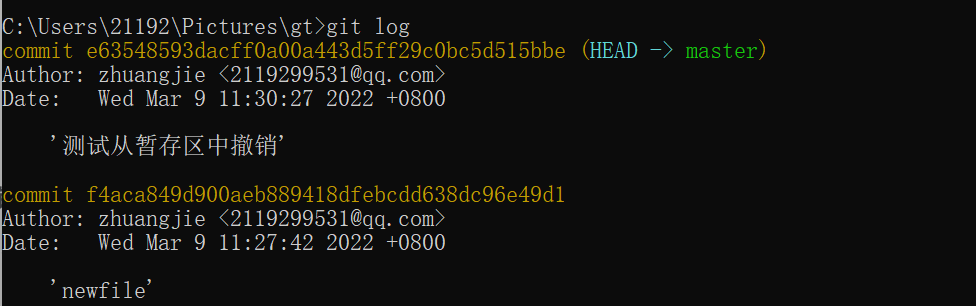

# Git

## 目录

*   [1）准备Git环境](#1准备git环境)

*   [2）概念](#2概念)

*   [3）高频使用命令](#3高频使用命令)

    *   *   [\[1\] 基本命令](#1-基本命令)

        *   [\[2\] 常规操作](#2-常规操作)

        *   [\[3\] 本地分支操作](#3-本地分支操作)

        *   [\[4\] 远程分支操作](#4-远程分支操作)

        *   [\[5\] 撤销操作](#5-撤销操作)

        *   [\[6\] 打标签](#6-打标签)

## 1）准备Git环境

\*\*1-1）下载Git: \*\*[**https://git-scm.com/downloads**](https://git-scm.com/downloads "https://git-scm.com/downloads")

**1-2）ssh-keygen #在本地生成ssh, 然后**将本地ssh的公钥加入在远程仓库容器的ssh配置中，这样电脑就可以操作该账号下的仓库了

**1-3）git config --global user.email '<XXXX@qq.com>'  //使用git初次使用的命令1**

&#x20;        **git config --global **[**user.name**](http://user.name "user.name")** '大聪明'    //使用git初次使用的命令**   &#x20;

## 2）概念

**ssh、分支、远程仓库**

**ssh：是一种安全可靠的技术，可以用来传输、远程登录等**

**分支：一个仓库可以有多个分支，这在公司中是非常有用的，如果要分一个小组来开发一个新功能就需要另开一个分支了，开发完后，然后再进行合并**

**远程仓库：与本地仓库相对应,比如github、gitee等**

## 3）高频使用命令

#### \[1] 基本命令

#### \[2] 常规操作

**git init   #创建一个本地仓库，伴生一个master本地分支**

**git clone -b 分支名 远程仓库地址（https、ssh） #克隆远程仓库到本地**

**git remote add origin 远程仓库链接（一般都用ssh） #添加远程仓库名字为origin(标准用名)**&#x20;

**git remote remove origin    #从本地远程仓库列表中移除名为"origin"的远程仓库地址**

**git branch -r #查看远程仓库**

**git add .     #“."代表全部,将全部的文件加入暂时区（可以是一个文件名，但很少这样用）**

**git status #红色代表在工作区，绿色在暂存区**

**git commit  -m '备注信息'    #将当前分支的暂时区代码提交当前分支的仓库中**

**git log  #查看当前分支下的仓库的commit记录**

**git push origin <本地分支名>:<远程分支名>   #将本地指定的分支与远程的仓库“origin"的指定分支名进行合并**

**#（如果在这个时候你的同事提交了代码，此时你仓库的代码不是最新的了，这个时候你需要拉取-处理冲突-提交）**

**git  pull origin master  #拉取origin远程仓库的代码与你本地的代码进行合并， 拉取代码-处理冲突-再提交**

#### \[3] 本地分支操作

**git branch  #查看本地仓库的分支列表**

**git checkout -b login #在本地仓库创建一个名为"login"的分支**

**git checkout master  #切换到master分支上**

**git branch -D zjazn  #删除名为zjazn的分支**

#### \[4] 远程分支操作

**git push origin <本地分支名>:<远程分支名>   #在本地仓库开辟一个分支后，当提交时的远程仓库分支不存在时，会自动创建**

**git push origin :<远程分支名>     #与一个空的仓库推送到远程分支中，就是删除**

**git merge <要合并的本地分支名>  #在本地合并后（被合并的分支不会删除），推送到远程仓库中，再删除远程仓库已被合并的分支**

#### \[5] 撤销操作

**—从工作区中撤销：就是还不在git的管理下的修改**

git checkout — \<file>  #如何是全部\<file>就是"."

**—从暂存区中撤销（git add后加入暂存区），** 注意撤销后，工作区中还有的！！就是从暂存区中删除了，这样就可以使用git checkout — <file> 从工作区中撤销了，add的内容，使用“git checkout ”命令是不可能撤销的！

git reset HEAD

**—从本地仓库中撤销（git commit 后放入本地仓库）**

从哪次的git commit中撤销，这我们得知道，所以要用

git log #查看

git reset f4aca849d900aeb889418dfebcdd638dc96e49d1  #返回到这一次去，请用git log查看\*\*（注意是撤销到这一次，而不是把这一次的撤销）\*\*

**—从远程仓库中撤销**

先从本地撤销，再push即可！

#### \[6] 打标签

**--打tag**

**git tag -a v版本号 -m 'tag信息'  #创建本地的tag**

**get tag  #查看tag**&#x20;

**git push origin v版本号   #提交指定tag到远程仓库**

**--删除tag**

**git tag -d v版本号 #删除本地仓库标签**

**git push origin :refs/tags/v版本号  #删除远程仓库标签**
