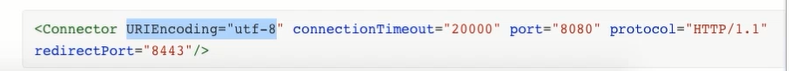

# 整合SprigMVC

## 目录

*   [如何整合到Spring？](#如何整合到spring)

    *   [\[\_1\_\] 基本整合](#_1_-基本整合)

    *   [- SpringMVC的执行流程](#--springmvc的执行流程)

    *   [+配置视图解析器](#配置视图解析器)

    *   [+如何解决springmvc拦截静态资源的问题](#如何解决springmvc拦截静态资源的问题)

    *   [+返回视图+model](#返回视图model)

    *   [+请求参数绑定](#请求参数绑定)

    *   [-限定请求方式](#-限定请求方式)

    *   [-自定义类型转换器](#-自定义类型转换器)

    *   [-REST风格](#-rest风格)

    *   [\[\_2\_\] 解决post请求数据乱码问题](#_2_-解决post请求数据乱码问题)

    *   [-get请求乱码问题：](#-get请求乱码问题)

    *   [\[\_3\_\] 前后端json交互](#_3_-前后端json交互)

    *   [-拦截器](#-拦截器)

    *   [-文件上传](#-文件上传)

    *   [-异常处理](#-异常处理)

    *   [+重定向与转发](#重定向与转发)

    *   [+友情链接](#友情链接)

## 如何整合到Spring？

### \[\_1\_] 基本整合

（1）创建一个webapp项目

（2）pom.xml依赖

*   pom.xml&#x20;

    ```xml
    <?xml version="1.0" encoding="UTF-8"?>

    <project xmlns="http://maven.apache.org/POM/4.0.0" xmlns:xsi="http://www.w3.org/2001/XMLSchema-instance"
      xsi:schemaLocation="http://maven.apache.org/POM/4.0.0 http://maven.apache.org/xsd/maven-4.0.0.xsd">
      <modelVersion>4.0.0</modelVersion>

      <groupId>com.zhuangjie</groupId>
      <artifactId>springmvc</artifactId>
      <version>1.0-SNAPSHOT</version>
      <packaging>war</packaging>

      <name>springmvc Maven Webapp</name>
      <!-- FIXME change it to the project's website -->
      <url>http://www.example.com</url>

      <properties>
        <project.build.sourceEncoding>UTF-8</project.build.sourceEncoding>
        <maven.compiler.source>1.7</maven.compiler.source>
        <maven.compiler.target>1.7</maven.compiler.target>
      </properties>

      <dependencies>
        <dependency>
          <groupId>junit</groupId>
          <artifactId>junit</artifactId>
          <version>4.11</version>
          <scope>test</scope>
        </dependency>

        <!--引入spring webmvc的依赖-->
        <dependency>
          <groupId>org.springframework</groupId>
          <artifactId>spring-webmvc</artifactId>
          <version>5.1.12.RELEASE</version>
        </dependency>
        <!--不引入，HttpServletRequest , HttpServletResponse , HttpSession 都不能引入，项目可以运行，是因为这个依赖在tomcat中有 -->
        <dependency>
          <groupId>javax.servlet</groupId>
          <artifactId>javax.servlet-api</artifactId>
          <version>3.1.0</version>
          <scope>provided</scope>
        </dependency>
      </dependencies>


      <build>
        <!--不写报错，指定一些目录或文件文件的位置-->
        <resources>
          <resource>
            <directory>src/main/java</directory>
            <includes>
              <include>**/*.properties</include>
              <include>**/*.xml</include>
            </includes>
            <filtering>false</filtering>
          </resource>
          <resource>
            <directory>src/main/resources</directory>
            <includes>
              <include>**/*.properties</include>
              <include>**/*.xml</include>
            </includes>
            <filtering>false</filtering>
          </resource>
        </resources>
        <!--    <finalName>demo</finalName> 自定义打包名-->
        <plugins>
          <plugin>
            <groupId>org.apache.maven.plugins</groupId>
            <artifactId>maven-war-plugin</artifactId>
            <version>2.2</version>
          </plugin>
        </plugins>

      </build>

    </project>


    ```

（3）配置扫描注解并配置全局Servlet

*   在resources中创建一个`springmvc.xml` 文件，主要作用是，配置扫描注解

    springmvc.xml：

    ```xml
    <?xml version="1.0" encoding="UTF-8"?>
    <beans xmlns="http://www.springframework.org/schema/beans"
           xmlns:xsi="http://www.w3.org/2001/XMLSchema-instance"
    xmlns:context="http://www.springframework.org/schema/context"
    xmlns:mvc="http://www.springframework.org/schema/mvc"
           xsi:schemaLocation="http://www.springframework.org/schema/beans http://www.springframework.org/schema/beans/spring-beans.xsd
    http://www.springframework.org/schema/context http://www.springframework.org/schema/context/spring-context.xsd
    http://www.springframework.org/schema/mvc http://www.springframework.org/schema/mvc/spring-mvc.xsd">


        <!--开启controller扫描（扫描的是Controller中的注解）-->
        <context:component-scan base-package="com.zhuangjie.springmvc.controller" />
        <!--配置springmvc的视图解析器（让我们在返回视图时，由原来的“/WEB-INF/jsp/success.jsp”只需写"success"即可）-->
        <bean class="org.springframework.web.servlet.view.InternalResourceViewResolver">
    <!--        <property name="prefix" value="/WEB-INF/jsp/"/>-->
    <!--        <property name="suffix" value=".jsp"/>-->
        </bean>


        <!--自动注册最合适的处理器映射器，处理器适配器(调用handler方法)-->
        <mvc:annotation-driven />


    </beans>
    ```

*   需要加载这个配置文件`springmvc.xml`。在配置全局servlet中将`springmvc.xml`进行加载。\*\*src/main/webapp/WEB-INF/web.xml \*\*文件下配置

    

    web.xml

    ```xml
    <!DOCTYPE web-app PUBLIC
     "-//Sun Microsystems, Inc.//DTD Web Application 2.3//EN"
     "http://java.sun.com/dtd/web-app_2_3.dtd" >

    <web-app>
      <display-name>Archetype Created Web Application</display-name>

      <!--这个servlet+servlet-mapping是（图）： https://cdn.jsdelivr.net/gh/18476305640/typora@master/image/16515703151461651570314937.png-->
      <servlet>
        <servlet-name>springmvc</servlet-name>
        <servlet-class>org.springframework.web.servlet.DispatcherServlet</servlet-class>
        <!--扫描springmvc.xml配置文件-->
        <init-param>
          <param-name>contextConfigLocation</param-name>
          <param-value>classpath:springmvc.xml</param-value>
        </init-param>
      </servlet>
      <servlet-mapping>
        <servlet-name>springmvc</servlet-name>
        <!--
          方式一：带后缀，比如*.action  *.do *.aaa
                 该种方式比较精确、方便，在以前和现在企业中都有很大的使用比例
          方式二：/ 不会拦截 .jsp，但是会拦截.html等静态资源（静态资源：除了servlet和jsp之外的js、css、png等）

                为什么配置为/ 会拦截静态资源？？？
                    因为tomcat容器中有一个web.xml（父），你的项目中也有一个web.xml（子），是一个继承关系
                          父web.xml中有一个DefaultServlet,  url-pattern 是一个 /
                          此时我们自己的web.xml中也配置了一个 / ,覆写了父web.xml的配置
                为什么不拦截.jsp呢？
                    因为父web.xml中有一个JspServlet，这个servlet拦截.jsp文件，而我们并没有覆写这个配置，
                    所以springmvc此时不拦截jsp，jsp的处理交给了tomcat


                如何解决/拦截静态资源这件事？


          方式三：/* 拦截所有，包括.jsp
        -->
        <!--拦截匹配规则的url请求，进入springmvc框架处理-->
        <url-pattern>/</url-pattern>
      </servlet-mapping>
    </web-app>

    ```

（4）写一个Controller

*   DomeController

    ```java
    package com.zhuangjie.springmvc.controller;

    import org.springframework.stereotype.Controller;
    import org.springframework.web.bind.annotation.RequestMapping;
    import org.springframework.web.servlet.ModelAndView;

    import java.util.Date;

    @Controller
    @RequestMapping("/demo")
    public class DemoController {
        /**
         * url: http://localhost:8080/demo/handle01
         */
        @RequestMapping("/handle01")
        public ModelAndView handle01() {
            System.out.println("你好服务器~");
            Date date = new Date();// 服务器时间
            // 返回服务器时间到前端页面
            // 封装了数据和页面信息的 ModelAndView
            ModelAndView modelAndView = new ModelAndView();
            // addObject 其实是向请求域中request.setAttribute("date",date);
            modelAndView.addObject("date",date);
            // 视图信息(封装跳转的页面信息) 逻辑视图名,在springmvc.xml已经配置了视图解析器
            modelAndView.setViewName("success");
            return modelAndView;
        }
    }

    ```

（5）写一个.jsp

*   success.jsp

    ```html
    <%@ page language="java" isELIgnored="false" contentType="text/html; charset=utf-8" pageEncoding="utf-8"%>

    <html>
    <head>
        <meta http-equiv="Content-Type" content="text/html; charset=utf-8" />
        <title>Insert title here</title>
    </head>
    <body>
    跳转成功！服务器时间：${date}
    </body>
    </html>
    ```

### - SpringMVC的执行流程


**流程说明**
第⼀步：⽤户发送请求⾄前端控制器DispatcherServlet
第⼆步：DispatcherServlet收到请求调⽤HandlerMapping处理器映射器
第三步：处理器映射器根据请求Url找到具体的Handler（后端控制器），⽣成处理器对象及处理器拦截
器(如果 有则⽣成)⼀并返回DispatcherServlet
第四步：DispatcherServlet调⽤HandlerAdapter处理器适配器去调⽤Handler
第五步：处理器适配器执⾏Handler
第六步：Handler执⾏完成给处理器适配器返回ModelAndView
第七步：处理器适配器向前端控制器返回 ModelAndView，ModelAndView 是SpringMVC 框架的⼀个
底层对 象，包括 Model 和 View
第⼋步：前端控制器请求视图解析器去进⾏视图解析，根据逻辑视图名来解析真正的视图。
第九步：视图解析器向前端控制器返回View
第⼗步：前端控制器进⾏视图渲染，就是将模型数据（在 ModelAndView 对象中）填充到 request 域
第⼗⼀步：前端控制器向⽤户响应结果

### +配置视图解析器

在`springmvc.xml` 配置文件中配置如下，这里我们可以直接返回视图名字XXX，就是自动变为`/WEB-INF/jsp/XXX.jsp` 了。

```xml
    <!--配置springmvc的视图解析器（让我们在返回视图时，由原来的“/WEB-INF/jsp/success.jsp”只需写"success"即可）-->
    <bean class="org.springframework.web.servlet.view.InternalResourceViewResolver">
        <property name="prefix" value="/WEB-INF/jsp/"/>
        <property name="suffix" value=".jsp"/>
    </bean>
```

### +如何解决springmvc拦截静态资源的问题

推荐的解决方案：

在`springmvc.xml` 中，加入：

```xml
  
    <!--静态资源配置，SpringMVC框架自己处理静态资源
        当url中与mapping的值时，会在location配置的值中去找
        比如 http://localhost:8080/js/hello.html ,那么如果有 /WEB-INF/js/hello.html这个文件，就会找到。
    -->
    <mvc:resources location="/WEB-INF/" mapping="/js/**"/>

```

不推荐的解决方案：也是在`springmvc.xml`中配置。不推荐的原因是，遇到静态资源后（由它内部决定），只会去`webapp`根中找，不会去子目录中找。

```xml
    <!--静态资源配置，方案一-->
    <!--
        原理：添加该标签配置之后，会在SpringMVC上下文中定义一个DefaultServletHttpRequestHandler对象
             这个对象如同一个检查人员，对进入DispatcherServlet的url请求进行过滤筛查，如果发现是一个静态资源请求
             那么会把请求转由web应用服务器（tomcat）默认的DefaultServlet来处理，如果不是静态资源请求，那么继续由
             SpringMVC框架处理
    -->
    <mvc:default-servlet-handler/>
```

### +返回视图+model

前端是jsp时：

`BindingAwareModelMap` 继承了`ExtendedModelMap` ，而ExtendedModelMap继承了`ModelMap`实现了`Model`，而`ModelMap`继承了LinkedHashMap且LinkedHashMap实现了`Map`

```html
    /**
     * url: http://localhost:8080/demo/handle01
     */
    @RequestMapping("/handle01")
    public ModelAndView handle01() {
        System.out.println("你好服务器~");
        Date date = new Date();// 服务器时间
        // 返回服务器时间到前端页面
        // 封装了数据和页面信息的 ModelAndView
        ModelAndView modelAndView = new ModelAndView();
        // addObject 其实是向请求域中request.setAttribute("date",date);
        modelAndView.addObject("date",date);
        // 视图信息(封装跳转的页面信息) 逻辑视图名
        modelAndView.setViewName("success");
        return modelAndView;
    }

    /**
     * url: http://localhost:8080/demo/handle02
     */
    @RequestMapping("/handle02")
    public String handle02(ModelMap modelMap) {
        System.out.println("你好服务器~");
        Date date = new Date();// 服务器时间
        // 返回服务器时间到前端页面
        modelMap.addAttribute("date",date);
        return "success";
    }
    /**
     * url: http://localhost:8080/demo/handle03
     */
    @RequestMapping("/handle03")
    public String handle03(Model model) {
        System.out.println("你好服务器~");
        Date date = new Date();// 服务器时间
        // 返回服务器时间到前端页面
        model.addAttribute("date",date);
        return "success";
    }
    /**
     * url: http://localhost:8080/demo/handle03
     */
    @RequestMapping("/handle04")
    public String handle04(Map<Object,Object> map) {
        System.out.println("你好服务器~");
        Date date = new Date();// 服务器时间
        // 返回服务器时间到前端页面
        map.put("date",date);
        return "success";
    }
```

### +请求参数绑定

基本类型的绑定

我们可以引入`HttpServletRequest `、`HttpServletResponse `、`HttpSession `使用。我们还可以使用注解将请求参数与方法参数绑定`@RequestParam("ids") Integer id` 这样当请求的参数中有`ids`时,就会将ids的值 与`id`绑定。

```java
    /**
     * url: http://localhost:8080/demo/handle05
     */
    @RequestMapping("/handle05")
    public void handle05(HttpServletRequest request, HttpServletResponse resource, HttpSession session) {
        //会获取/demo/handle05?id=5 的id值
        System.out.println(request.getParameter("id"));

    }

    /**
     * url: http://localhost:8080/demo/handle06
     */
    @RequestMapping("/handle06")
    // 会将 /demo/handle06?ids=6 中的ids的值与id绑定
    public void handle06(@RequestParam("ids") Integer id) {
        System.out.println(id);

    }
```

注意事项：最好`使用包装类型`、且如果绑定的到boolean时，在值转换时，如果不是true、false、1、0时会报错。而不使用包装类型，就更容易报错，比如int时请求值是null时。

绑定JOPO：前台传入多个参数,并且这些参数都是一个对象的属性

`/demo/handle07?id=192&name=zhuangjie` 这是我们的请求，`public void handle07(User user) { ...}`  这是我们要Controller的处理方法，其中的id与name的值将自动与我们User中的属性进行绑定。

如果User里面还有一个User属性，我们想要绑定到那里面去，请求应改为`/demo/handle07?user.id=192&user.name=zhuangjie` &#x20;

### -限定请求方式

在@RequestMapping注解中添加一个method的参数

```java
@RequestMapping(value="/toLogin",method = RequestMethod.GET)
public ModelAndView toLogin(){}
```

### -自定义类型转换器

先写一个转换器：

创建一个目录`converter` 与controller目录同级，在“converter”目录下创建一个文件

DateConverter.java:

```java
package com.zhuangjie.springmvc.converter;

import org.springframework.core.convert.converter.Converter;

import java.text.ParseException;
import java.text.SimpleDateFormat;
import java.util.Date;

/**
 * @author zhuangjie
 *  自定义类型转换器
 * S：source，源类型
 * T：target：目标类型
 */
public class DateConverter implements Converter<String, Date> {

    @Override
    public Date convert(String source) {
        //完成字符串向日期的转换
        SimpleDateFormat simpleDateFormat = new SimpleDateFormat("yyyy-MM-dd");
        try {
            Date parse = simpleDateFormat.parse(source);
            return parse;
        } catch (ParseException e) {
            SimpleDateFormat simpleDateFormat_2 = new SimpleDateFormat("yyyy/MM/dd");
            try {
                Date parse = simpleDateFormat_2.parse(source);
            } catch (ParseException parseException) {
                parseException.printStackTrace();
            }

        }
        return null;
    }
}
```

我们需要在`src/main/resources/springmvc.xml` 文件中配置，需要使用FactoryBean，进行注册然后，加载。

之前的`src/main/resources/springmvc.xml`相关配置：

```xml
    <mvc:annotation-driven conversion-service="conversionServiceBean"/>
```

配置后：

```xml
    <!--自动注册最合适的处理器映射器，处理器适配器(调用handler方法)-->
    <mvc:annotation-driven conversion-service="conversionServiceBean"/>

    <!--注册自定义类型转换器-->
    <bean id="conversionServiceBean" class="org.springframework.format.support.FormattingConversionServiceFactoryBean">
        <property name="converters">
            <set>
                <bean class="com.zhuangjie.springmvc.converter.DateConverter"></bean>
            </set>
        </property>
    </bean>
```

### -REST风格

Restful 是⼀种 web 软件架构⻛格，它不是标准也不是协议，它倡导的是⼀个资源定位及资源操作的⻛
格。

核心：先定位资源，再操作（请求方式）。

配置支持：不配置的话，只支持get、post、当前端无法发送`put、delete` 请求时，前端需要加一个隐藏的参数`_method=请求方式` 让后端知道是什么请求，为什么是`_method`这是由HiddenHttpMethodFilter类决定的，后端通过以下配置进行适配：

web.xml

```xml
  <!--配置springmvc请求方式转换过滤器，会检查请求参数中是否有_method参数，如果有就按照指定的请求方式进行转换-->
  <filter>
    <filter-name>hiddenHttpMethodFilter</filter-name>
    <filter-class>org.springframework.web.filter.HiddenHttpMethodFilter</filter-class>
  </filter>

  <filter-mapping>
    <filter-name>hiddenHttpMethodFilter</filter-name>
    <url-pattern>/*</url-pattern>
  </filter-mapping>
```

Controller：`@PathVariable("id") ` 注解就非常关键。

```java
@Controller
@RequestMapping("/demo")
public class DemoController {

    @RequestMapping(value = "/handle09/{id}", method = RequestMethod.GET)
    public void handle09_1(@PathVariable("id") Integer id) {
        System.out.println(id);

    }
    @RequestMapping(value = "/handle09/{id}", method = RequestMethod.POST)
    public void handle09_2(@PathVariable("id") Integer id) {
        System.out.println(id);

    }
    @RequestMapping(value = "/handle09/{id}", method = RequestMethod.PUT)
    public void handle09_3(@PathVariable("id") Integer id) {
        System.out.println(id);

    }
    @RequestMapping(value = "/handle09/{id}", method = RequestMethod.DELETE)
    public void handle09_4(@PathVariable("id") Integer id) {
        System.out.println(id);

    }
}
```

.jsp

```html
<div>
    <h2>SpringMVC对Restful风格url的支持</h2>
    <fieldset>
        <p>测试用例：SpringMVC对Restful风格url的支持</p>

        <a href="/demo/handle09/15">rest_get测试</a>


        <form method="post" action="/demo/handle09/15">
            <input type="text" name="username"/>
            <input type="submit" value="提交rest_post请求"/>
        </form>


        <form method="post" action="/demo/handle09/15">
            <input type="hidden" name="_method" value="put"/>
            <input type="submit" value="提交rest_put请求"/>
        </form>


        <form method="post" action="/demo/handle09/15">
            <input type="hidden" name="_method" value="delete"/>
            <input type="submit" value="提交rest_delete请求"/>
        </form>
    </fieldset>
</div>
```

### \[\_2\_] 解决post请求数据乱码问题

post请求乱码问题

web.xml

```xml
  <!--springmvc提供的针对post请求的编码过滤器-->
  <filter>
    <filter-name>encoding</filter-name>
    <filter-class>org.springframework.web.filter.CharacterEncodingFilter</filter-class>
    <init-param>
      <param-name>encoding</param-name>
      <param-value>UTF-8</param-value>
    </init-param>
  </filter>
  <filter-mapping>
    <filter-name>encoding</filter-name>
    <url-pattern>/*</url-pattern>
  </filter-mapping>
```

### -get请求乱码问题：

tomcat→conf→server.xml ， 将URIEncoding="utf-8" 放在Connector中。



```xml
<ConnectorURIEncoding="utf-8" connectionTimeout="20000" port="8080" protocol="HTTP/1.1" redirectPort="8443"/>
```

或者对得到的值进行重新编码：

```java
String userName = new String(request.getParamter("userName").getBytes("ISO8859-1"),"utf-8");
```

### \[\_3\_] 前后端json交互

**前端到服务器**

1.  后端需要加入json的依赖，不然会报415

    *   json依赖

        ```xml
            <!--json数据交互所需jar，start-->
            <dependency>
              <groupId>com.fasterxml.jackson.core</groupId>
              <artifactId>jackson-core</artifactId>
              <version>2.9.0</version>
            </dependency>
            <dependency>
              <groupId>com.fasterxml.jackson.core</groupId>
              <artifactId>jackson-databind</artifactId>
              <version>2.9.0</version>
            </dependency>
            <dependency>
              <groupId>com.fasterxml.jackson.core</groupId>
              <artifactId>jackson-annotations</artifactId>
              <version>2.9.0</version>
            </dependency>
        ```

2.  Controller要接收成实体(json=>实体)，要使用`@RequestBody` 注解。前端要注意`contentType` 属性（告诉服务器，前端发送的是什么数据）与`data`的值是json字符串，否则也会导致报415

    *   Controller示例

        ```java
            @RequestMapping("/handle10")
            public void handle09_4(@RequestBody User user) {

                System.out.println("===>");


            }
        ```

    *   前端Ajax示例

        ```javascript
        $.ajax({
            type: "post",
            url: "/demo/handle10",
            data: JSON.stringify({"id":"1923","name":"zhuangjie"}),
            dataType: "json",
            contentType:'application/json;charset=utf-8',
            success: function(result){
                console.log("ok",result);
            }
        })
        ```

**服务器到前端（服务器返回json）**

1.  后端需要加入json的依赖，不然会报415

    *   **json依赖**

        ```xml
            <!--json数据交互所需jar，start-->
            <dependency>
              <groupId>com.fasterxml.jackson.core</groupId>
              <artifactId>jackson-core</artifactId>
              <version>2.9.0</version>
            </dependency>
            <dependency>
              <groupId>com.fasterxml.jackson.core</groupId>
              <artifactId>jackson-databind</artifactId>
              <version>2.9.0</version>
            </dependency>
            <dependency>
              <groupId>com.fasterxml.jackson.core</groupId>
              <artifactId>jackson-annotations</artifactId>
              <version>2.9.0</version>
            </dependency>
        ```

2.  Controller需要用到`@ResponseBody` 注解（添加@ResponseBody之后，不再⾛视图解析器那个流程，⽽是等同于response直接输出数据），

    *   **Controller**：特别地@RestController = @Controller + @ResponseBody

        > @ResponseBody的使用时机：返回的数据不是html标签的页面，而是其他某种格式的数据时（如json、xml等）使用；

        ```java
            @RequestMapping("/handle10")
            public @ResponseBody User handle09_4(@RequestBody User user) {
                System.out.println(user.getName());
                user.setName("张三丰");
                return user;
            }
        ```

    *   **前端**：前端Ajax需要添加`dataType`属性，告诉服务器返回json类型的数据给前端。

        ```html
        // 发送ajax请求
        $.ajax({
            type: "post",
            url: "/demo/handle10",
            data: JSON.stringify({"id":"1923","name":"zhuangjie"}),
            dataType: "json",
            contentType:'application/json;charset=utf-8',
            success: function(result){
                console.log(result.name)
            }
        })
        ```

### -拦截器

拦截器（Interceptor）：是SpringMVC、Struts等表现层框架⾃⼰的，不会拦截jsp/html/css/image的访问等，只会拦截访问的控制器⽅法（Handler）。


多个拦截器的拦截规则是配置文件自上而下的顺序（1上2下时）。


验证：

```java
MyIntercepter01 preHandle......
2：MyIntercepter02 preHandle......
handler方法执行了...
2：MyIntercepter02 postHandle......
MyIntercepter01 postHandle......
2：MyIntercepter02 afterCompletion......
MyIntercepter01 afterCompletion......
```

开始>>>

创建一个目录`interceptor` 在里面创建一个类：

*   MyInterceptor01：

    ```java
    package com.zhuangjie.springmvc.interceptor;

    import org.springframework.web.servlet.HandlerInterceptor;
    import org.springframework.web.servlet.ModelAndView;

    import javax.servlet.http.HttpServletRequest;
    import javax.servlet.http.HttpServletResponse;

    /**
     * 自定义拦截器
     */
    public class MyIntercepter01 implements HandlerInterceptor {
        /**
         * 会在handler方法业务逻辑执行之前执行
         * 往往在这里完成权限校验工作
         * @param request
         * @param response
         * @param handler
         * @return  返回值boolean代表是否放行，true代表放行，false代表中止
         * @throws Exception
         */
        @Override
        public boolean preHandle(HttpServletRequest request, HttpServletResponse response, Object handler) throws Exception {
            System.out.println("MyIntercepter01 preHandle......");
            return true;
        }


        /**
         * 会在handler方法业务逻辑执行之后尚未跳转页面时执行
         * @param request
         * @param response
         * @param handler
         * @param modelAndView  封装了视图和数据，此时尚未跳转页面呢，你可以在这里针对返回的数据和视图信息进行修改
         * @throws Exception
         */
        @Override
        public void postHandle(HttpServletRequest request, HttpServletResponse response, Object handler, ModelAndView modelAndView) throws Exception {
            System.out.println("MyIntercepter01 postHandle......");
        }

        /**
         * 页面已经跳转渲染完毕之后执行
         * @param request
         * @param response
         * @param handler
         * @param ex  可以在这里捕获异常
         * @throws Exception
         */
        @Override
        public void afterCompletion(HttpServletRequest request, HttpServletResponse response, Object handler, Exception ex) throws Exception {
            System.out.println("MyIntercepter01 afterCompletion......");
        }
    }

    ```

然后进行配置加载，在`springmvc.xml` 编辑：

*   将拦截器配置

    ```java
    ```

### -文件上传

前端：

*   .jsp\html

    ```html
        <fieldset>
            <%--form表彰要加入这些
                1 method="post"
                2 enctype="multipart/form-data"
                3 type="file"
            --%>
            <form method="post" enctype="multipart/form-data" action="/demo/upload">
                <input type="file" name="uploadFile"/>
                <input type="submit" value="上传"/>
            </form>
        </fieldset>
    ```

后端配置：

*   加入依赖

    pom.xml

    ```xml
        <!--文件上传所需坐标-->
        <dependency>
          <groupId>commons-fileupload</groupId>
          <artifactId>commons-fileupload</artifactId>
          <version>1.3.1</version>
        </dependency>
    ```

*   后端上传Controller方法示例

    ```java
        /**
         * 文件上传
         * @return
         */
        @RequestMapping(value = "/upload")
        public ModelAndView upload(MultipartFile uploadFile, HttpSession session) throws IOException {

            // 处理上传文件
            // 重命名，原名123.jpg ，获取后缀
            String originalFilename = uploadFile.getOriginalFilename();// 原始名称
            // 扩展名  jpg
            String ext = originalFilename.substring(originalFilename.lastIndexOf(".") + 1, originalFilename.length());
            String newName = UUID.randomUUID().toString() + "." + ext;

            // 存储,要存储到指定的文件夹，/uploads/yyyy-MM-dd，考虑文件过多的情况按照日期，生成一个子文件夹
            String realPath = session.getServletContext().getRealPath("/uploads");
            System.out.println("上传文件的路径："+realPath);
            String datePath = new SimpleDateFormat("yyyy-MM-dd").format(new Date());
            File folder = new File(realPath + "/" + datePath);

            if(!folder.exists()) {
                folder.mkdirs();
            }


            // 存储文件到目录
            uploadFile.transferTo(new File(folder,newName));


            // TODO 文件磁盘路径要更新到数据库字段

            Date date = new Date();
            ModelAndView modelAndView = new ModelAndView();
            modelAndView.addObject("date",date);
            modelAndView.setViewName("success");
            return modelAndView;
        }
    ```

### -异常处理

创建一个类，这个类，能被扫描到即可，比如在controller下创建一个类`ExceptionResolver`

*   ExceptionResolver.java

    ```java
    package com.zhuangjie.springmvc.controller;

    import org.springframework.web.bind.annotation.ControllerAdvice;
    import org.springframework.web.bind.annotation.ExceptionHandler;
    import org.springframework.web.servlet.ModelAndView;

    import javax.servlet.http.HttpServletResponse;
    //@ControllerAdvice 标识一个类是全局异常处理类
    @ControllerAdvice
    public class GlobalExceptionResolver {
        @ExceptionHandler(Exception.class)
        public ModelAndView handleException(Exception exception, HttpServletResponse response) {
            System.out.println("错误处理器~");
            ModelAndView modelAndView = new ModelAndView();
            //返回的视图，这里使用到了
            modelAndView.setViewName("error");
            modelAndView.addObject("msg",exception.getMessage());
            return modelAndView;
        }
    }


    ```

### +重定向与转发

我们能填这返回`"redirect:redirectTarget"`即可进行重定向，因为重定向是不传递请求数据的，如果要设置，要在方法参数加`RedirectAttributes redirectAttributes` 这个参数，通过调用`addFlashAttribute("key","value");` 往里面放入值。那重定向的headle怎么取出来呢，需要使用`@ModelAttribute("name") ` 注解进行绑定了。

```java
    @RequestMapping("/direct")
    public String headleRedirect(String name, RedirectAttributes redirectAttributes) {
        System.out.println("准备重定向");
        redirectAttributes.addFlashAttribute("name","小李");
        return "redirect:redirectTarget"; //重定向
        //return "forward:tologin";  //转发
    }
    @RequestMapping("/redirectTarget")
    public String redirectTarget(@ModelAttribute("name") String name) {
        System.out.println("name="+name);
        return "redirect:handle01";
    }
```

### +友情链接

[自定义mvc](自定义mvc/自定义mvc.md "自定义mvc")

[SpringMVC源码分析](SpringMVC源码分析/SpringMVC源码分析.md "SpringMVC源码分析")
