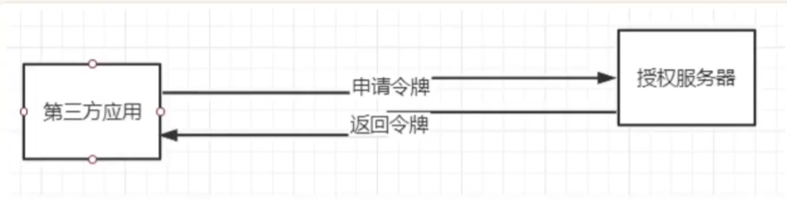

# OAuth2.0

## 目录

### 1.1模式的介绍

——模式的不同，信任也不同。

在梳理OAuth2.0协议流程的过程中，其实有一个主线，就是三方参与者之家的信任程度。

#### \[1] 授权码模式

用户、第三方、授权服务器 三方都互相不相任。

#### \[2] 简化模式

授权服务器对第三方相任，授权服务器当用户授权后，直接给服务器令牌，而不是授权码。

#### \[3] 密码模式

用户对第三方比较信任，直接给于密码给第三方获取令牌。

#### \[4] 客户端模式

三方互信，要就直接给我，在同一系统下使用。

[JWT](JWT/JWT.md "JWT")
