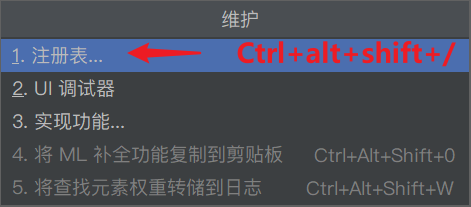

# SpringBoot

## 目录

### -SpringBoot的引出

**优点：**
spring是Java企业版（Java Enterprise Edition,JEE,也称2EE)的轻量级代替品。无需开发重量级的EnterpriseJavaBean(EJB),Spring为企业级Java开发提供了一种相对简单的方法，通过依赖**注入和面向切面编程**，用简单的Java对象（Plain Old Java Object,POJO)实现了EJB的功能。

**缺点：**
虽然Spring的组件代码是轻量级的，但它的配置却是重量级的。一开始，Spring用XML配置，而且是**很多XML配置**。Spring2.5引入了基于注解的组件扫描，这消除了大量针对应用程序自身组件的显式XML配置。Spring 3.0引入了基于Java的配置，这是一种类型安全的可重构配置方式，可以代替XML。所有这些配置都代表了开发时的损耗。因为在思考Spring特性配置和解决业务问题之间需要进行思维切换，所以编写配置挤占了编写应用程序逻辑的时间。和所有框架一样，Spring实用，但与此同时它要求的回报也不少。除此之外，**项目的依赖管理**也是一件耗时耗力的事情。在环境搭建时，需要分析要导入哪些库的坐标，而且还需要分析导入与之有依赖关系的其他库的坐标，一旦选错了**依赖的版本**，随之而来的不兼容问题就会严重阻碍项目的开发进度。

### -SpringBoot解决的问题

SpringBoot对上述Spring的缺点进行的改善和优化，基于约定优于配置的思想，可以让开发人员不必在配置与逻辑业务之间进行思维的切换，全身心的投入到逻辑业务的代码编写中，从而大大提高了开发的效率，一定程度上缩短了项目周期。

**起步依赖：**

起步依赖本质上是一个Maven项目对象模型（Project Object Model,POM),定义了对其他库的传递依赖，这些东西加在一起即支持某项功能。简单的说，起步依赖就是将具备某种功能的坐标打包到一起，并提供一些默认的功能。

**自动配置：**

springboot的自动配置，指的是springboot会自动将一些配置类的bean注册进ioc容器，我们可以需要的地方使用@Autowired或者@Resource等注解来使用它。“自动”的表现形式就是我们只需要引我们想用功能的包，相关的配置我们完全不用管，springboot会自动注入这些配置bean,我们直接使用这些bean即可springboot:简单、快速、方便地搭建项目；对主流开发框架的无配置集成；极大提高了开发、部署效率。

### \[\_1\_] 创建一个初始化SpringBoot项目

*   使用IDEA创建流程

    

    

    

    然后接着创建即可。

*   写一个Controller

    DemoController.java

    ```java
    package com.zhuangjie.springboot.controller;

    import org.springframework.web.bind.annotation.RequestMapping;
    import org.springframework.web.bind.annotation.RestController;

    @RestController
    @RequestMapping("/demo")
    public class DemoController {

        @RequestMapping("/test")
        public String test() {
            return "你好，Springboot";
        }

    }

    ```

*   将XXXApplication.java 类文件放在与`controller` 同级目录下。因为默认扫描XXXApplication.java。即可启动！


### \[\_2\_] 加入单元测试

*   pom.xml 依赖

    ```xml
            <dependency>
                <groupId>org.springframework.boot</groupId>
                <artifactId>spring-boot-starter-test</artifactId>
                <scope>test</scope>
            </dependency>
            <!--如果spring-boot-starter-test 中没有junit，还需要导入junit-->
            <dependency>
                <groupId>junit</groupId>
                <artifactId>junit</artifactId>
                <scope>test</scope>
            </dependency>
    ```

测试入口： 需要在原有注解上再加入`@RunWith(SpringRunner.class) `注解


### +热部署

1.  加入依赖

    *   pom.xml

        ```xml
                <dependency>
                    <groupId>io.gitlab.wmwtr</groupId>
                    <artifactId>spring-boot-devtools</artifactId>
                    <version>1.0.0.RELEASE</version>
                </dependency>
        ```

2.  配置IDEA

    *   配置1：

        

    *   配置2：

        

        

3.  测试

    比如：改变一下，访问的结果。

### -利用@ConfigurationProperties文件为类属性注入值

*   加入依赖

    pom.xml ：

    ```xml
            <dependency>
                <groupId>org.springframework.boot</groupId>
                <artifactId>spring-boot-configuration-processor</artifactId>
            </dependency>
    ```

*   被注入值的类

    1.  加入

        @Component
        @ConfigurationProperties(prefix = "XXXX") 注解

    2.  要加入属性的set方法。&#x20;

        ```java
        package com.zhuangjie.sx.demo.pojo;

        import org.springframework.boot.context.properties.ConfigurationProperties;
        import org.springframework.stereotype.Component;

        import java.util.List;
        import java.util.Map;

        @Component
        @ConfigurationProperties(prefix = "person")
        public class Person {
            private String name;
            private List<String> habbys;
            private Map<String,String> map;
            private Utils utils;

            @Override
            public String toString() {
                return "Person{" +
                        "name='" + name + '\'' +
                        ", habbys=" + habbys +
                        ", map=" + map +
                        ", utils=" + utils +
                        '}';
            }

            public String getName() {
                return name;
            }

            public void setName(String name) {
                this.name = name;
            }

            public List<String> getHabbys() {
                return habbys;
            }

            public void setHabbys(List<String> habbys) {
                this.habbys = habbys;
            }

            public Map<String, String> getMap() {
                return map;
            }

            public void setMap(Map<String, String> map) {
                this.map = map;
            }

            public Utils getUtils() {
                return utils;
            }

            public void setUtils(Utils utils) {
                this.utils = utils;
            }
        }


        ```

        赋值类依赖的类：

        Utils.java

        ```java
        package com.zhuangjie.sx.demo.pojo;

        import com.fasterxml.jackson.annotation.JsonFormat;

        import java.util.Date;

        public class Utils {
            private String utilsName;
            private String type;

            public String getUtilsName() {
                return utilsName;
            }

            public void setUtilsName(String utilsName) {
                this.utilsName = utilsName;
            }

            public String getType() {
                return type;
            }

            public void setType(String type) {
                this.type = type;
            }

            @Override
            public String toString() {
                return "Utils{" +
                        "utilsName='" + utilsName + '\'' +
                        ", type='" + type + '\'' +
                        '}';
            }
        }

        ```

*   配置属性

    第一种：application.properties ：

    ```.properties
    person.name=zhuangjie
    person.habbys=吃饭,睡觉
    person.map.k1=v1
    person.map.k2=v2
    person.utils.utilsName=box
    person.utils.type=vg

    ```

    第二种：application.yaml

    ```yaml
    person:
      name: zhuangjie
      habbys: ['吃饭','睡觉']
      map: {k1: v1,k2: v2}
      utils: {utilsName: box, type: vd}
    ```

    顺序是：

    

### -利用@Value() 为类属性注入值

*   application.yaml

    ```yaml
    utils: {utilsName: box, type: vd}
    ```

*   Utils.java: 在加入@Component注解基础上，在属性上加入 @Value注解（可以不要构造与set方法）。

    ```java
    package com.zhuangjie.sx.demo.pojo;
      
    import com.fasterxml.jackson.annotation.JsonFormat;
    import org.springframework.beans.factory.annotation.Value;
    import org.springframework.stereotype.Component;

    import java.util.Date;
    @Component
    public class Utils {
        @Value("${utils.utilsName}")
        private String utilsName;
        @Value("${utils.type}")
        private String type;

        @Override
        public String toString() {
            return "Utils{" +
                    "utilsName='" + utilsName + '\'' +
                    ", type='" + type + '\'' +
                    '}';
        }
    }

    ```

*   单元测试：

    ```java
    package com.zhuangjie.sx.demo;

    import com.zhuangjie.sx.demo.pojo.Person;
    import com.zhuangjie.sx.demo.pojo.Utils;
    import org.junit.jupiter.api.Test;
    import org.junit.runner.RunWith;
    import org.springframework.beans.factory.annotation.Autowired;
    import org.springframework.boot.test.context.SpringBootTest;
    import org.springframework.test.context.junit4.SpringRunner;

    @RunWith(SpringRunner.class)
    @SpringBootTest
    class DemoApplicationTests {

        @Autowired
        private Utils utils;

        @Test
        void contextLoads() {
            System.out.println(utils);
        }

    }

    ```

### -使用自定义properties文件为类注入属性

*   将注入属性值的类

    Utils.java：

    需要

    @Component
    @PropertySource("classpath:test.properties") //指定的配置文件
    @ConfigurationProperties(prefix = "utils")  //具体哪个为类配置值
    需要set方法。

    ```java
    package com.zhuangjie.sx.demo.pojo;

    import com.fasterxml.jackson.annotation.JsonFormat;
    import org.springframework.beans.factory.annotation.Value;
    import org.springframework.boot.context.properties.ConfigurationProperties;
    import org.springframework.context.annotation.PropertySource;
    import org.springframework.stereotype.Component;


    @Component
    @PropertySource("classpath:test.properties") //指定的配置文件
    @ConfigurationProperties(prefix = "utils")  //具体哪个为类配置值
    public class Utils {
        private String utilsName;
        private String type;

        public String getUtilsName() {
            return utilsName;
        }

        public void setUtilsName(String utilsName) {
            this.utilsName = utilsName;
        }

        public String getType() {
            return type;
        }

        public void setType(String type) {
            this.type = type;
        }

        @Override
        public String toString() {
            return "Utils{" +
                    "utilsName='" + utilsName + '\'' +
                    ", type='" + type + '\'' +
                    '}';
        }
    }

    ```

*   自定义一个properties文件

    test.properties

    ```.properties
    utils.utilsName= io
    utils.type= vg
    ```

*   单元测试

    ```java
    package com.zhuangjie.sx.demo;

    import com.zhuangjie.sx.demo.pojo.Person;
    import com.zhuangjie.sx.demo.pojo.Utils;
    import org.junit.jupiter.api.Test;
    import org.junit.runner.RunWith;
    import org.springframework.beans.factory.annotation.Autowired;
    import org.springframework.boot.test.context.SpringBootTest;
    import org.springframework.test.context.junit4.SpringRunner;

    @RunWith(SpringRunner.class)
    @SpringBootTest
    class DemoApplicationTests {

        @Autowired
        private Utils utils;

        @Test
        void contextLoads() {
            System.out.println(utils);
        }

    }

    ```

### -使用自定义配置类创建Bean

*   配置类

    与controller下创建一个config文件夹，里面创建类：

    MyService.java

    ```java
    package com.zhuangjie.sx.demo.config;

    import com.zhuangjie.sx.demo.pojo.Utils;
    import org.springframework.context.annotation.Bean;
    import org.springframework.context.annotation.Configuration;

    @Configuration
    public class MyService {

        @Bean("zjazn") //存放的Bean的名称，否则默认是方法名 MyUtils
        public Utils MyUtils() {
            Utils utils = new Utils();
            utils.setUtilsName("不木");
            utils.setType("99");
            return utils;
        }
    }

    ```

*   单元测试

    ```java
    package com.zhuangjie.sx.demo;

    import com.zhuangjie.sx.demo.pojo.Person;
    import com.zhuangjie.sx.demo.pojo.Utils;
    import org.junit.jupiter.api.Test;
    import org.junit.runner.RunWith;
    import org.springframework.beans.factory.annotation.Autowired;
    import org.springframework.boot.test.context.SpringBootTest;
    import org.springframework.context.ApplicationContext;
    import org.springframework.test.context.junit4.SpringRunner;

    @RunWith(SpringRunner.class)
    @SpringBootTest
    class DemoApplicationTests {

        @Autowired
        private Utils utils;
        @Autowired
        private ApplicationContext context;

        @Test
        void contextLoads() {
            //查看是否存在zjazn这个Bean
            System.out.println(context.containsBean("zjazn"));
        }

    }

    ```

### -随机数设置

*   在properties配置文件配置值时，可以通过以下设置不同类型的随机值, 到时候获取时，就是生成的随机值，这里就不作测试了。

    application.properties：

    ```.properties
    utils.type=${random.value}
    ```

*   规则：

    ```.properties
    my.secret=${random.value}
    //配置随机值
    my.number=${random.int}
    //配置随机整数
    my.bignumber = $ { random.long )
    //配置随机long类型数
    my.uuid=${random.uuid}
    //配置随机uuid类型数
    my.number.less.than.ten=${random.int(10)}  //配置小于10的随机整数
    my.number.in.range=${random.int[1024,65536])  //配置范围在[1024,65536]之间的随机整数
    ```

### -引用间引用(属性抽取公用)

application.properties:

```.properties
zjazn.user=${random.value}
utils.utilsName=${zjazn.user}
```

### \[\_3\_] 整合MyBaties

**注解的方式**

*   pom.xml :引入依赖

    ```xml
            <!--整合mybaties-->
            <dependency>
                <groupId>org.mybatis.spring.boot</groupId>
                <artifactId>mybatis-spring-boot-starter</artifactId>
                <version>2.1.2</version>
            </dependency>
            <dependency>
                <groupId>mysql</groupId>
                <artifactId>mysql-connector-java</artifactId>
                <scope>runtime</scope>
            </dependency>
    ```

*   application.properties: 配置数据库连接信息

    ```.properties
    #MySQL数据库连接配置 , com.mysql.cj.jdbc.Driver 无需再写驱动  ,内部已经注册
    spring.datasource.url=jdbc:mysql://localhost:3306/bank?serverTimezone=UTC
    spring.datasource.username=root
    spring.datasource.password=3333

    #配置驼峰 ,即能将数据库的xx_yy列，映射为实体的xxYy，否则该列将无值。
    mybatis.configuration.map-underscore-to-camel-case=true

    ```

*   dao → User.java 写表对应的实体

    ```java
    package com.zhuangjie.sx.demo.pojo;

    public class User {
        private Integer userId;
        private String name;
        private Integer money;

        //忽略了 get set方法...
        //忽略了 toString方法...
    }

    ```

*   mapper → UserMapper.java 接口

    ```java
    package com.zhuangjie.sx.demo.mapper;

    import com.zhuangjie.sx.demo.pojo.User;
    import org.apache.ibatis.annotations.Mapper;
    import org.apache.ibatis.annotations.Select;
    import org.springframework.stereotype.Component;

    import java.util.List;

    @Component  //标记为这是一个组件
    @Mapper //标记为mapper类
    public interface UserMapper {
        @Select("select * from user")  //注解方法
        List<User> queryAll();
    }

    ```

*   测试: 注入，调用方法

**XML方式**

*   pom.xml :引入依赖

    ```xml
            <!--整合mybaties-->
            <dependency>
                <groupId>org.mybatis.spring.boot</groupId>
                <artifactId>mybatis-spring-boot-starter</artifactId>
                <version>2.1.2</version>
            </dependency>
            <dependency>
                <groupId>mysql</groupId>
                <artifactId>mysql-connector-java</artifactId>
                <scope>runtime</scope>
            </dependency>
    ```

*   application.properties: 配置数据库连接信息

    ```.properties
    #MySQL数据库连接配置 , com.mysql.cj.jdbc.Driver 无需再写驱动  ,内部已经注册
    spring.datasource.url=jdbc:mysql://localhost:3306/bank?serverTimezone=UTC
    spring.datasource.username=root
    spring.datasource.password=3333

    #配置驼峰 ,即能将数据库的xx_yy列，映射为实体的xxYy，否则该列将无值。
    mybatis.configuration.map-underscore-to-camel-case=true

    #配置mybaties的xml配置文件路径
    mybatis.mapper-locations=classpath:mapper/*.xml

    ```

*   dao → User.java 写表对应的实体

    ```java
    package com.zhuangjie.sx.demo.pojo;

    public class User {
        private Integer userId;
        private String name;
        private Integer money;

        //忽略了 get set方法...
        //忽略了 toString方法...
    }

    ```

*   mapper → UserMapper.java 接口

    ```java
    package com.zhuangjie.sx.demo.mapper;

    import com.zhuangjie.sx.demo.pojo.User;
    import org.apache.ibatis.annotations.Mapper;
    import org.apache.ibatis.annotations.Select;
    import org.springframework.stereotype.Component;

    import java.util.List;
    //标记为这是一个组件, 可以在启动类中加@MapperScan代替，不然每个Mapper接口都要写。
    @Component  
    @Mapper //标记为mapper类
    public interface UserMapper {
         User queryById(Integer user_id);
    }

    ```

*   配置XML

    因为我们指定了xml的位置在classpath:mapper 下所以

    UserMapper.xml

    ```xml
    <?xml version="1.0" encoding="UTF-8" ?>
    <!DOCTYPE mapper
            PUBLIC "-//mybatis.org//DTD Mapper 3.0//EN"  "http://mybatis.org/dtd/mybatis-3-mapper.dtd">
    <mapper namespace="com.zhuangjie.sx.demo.mapper.UserMapper">
        <select id="queryById" resultType="com.zhuangjie.sx.demo.pojo.User" parameterType="int">
            select * from user where user_id = #{user_id}
        </select>
    </mapper>

           
    ```

*   测试: 注入，调用方法

*   改善

    **改善1：** mapper接口上的@Component注解，可以去掉，在springboot启动类上加@MapperScan("com.zhuangjie.sx.demo.mapper") 注解来指定mapper接口在哪里。

    

    改善2：xml配置实体的别名设置

    application.properties：追加

    ```.properties
    #配置mybaties映射配置文件中实体类别名
    mybatis.type-aliases-package=com.zhuangjie.sx.demo.pojo
    ```

    以前要用pojo实体类的全类名作xml中的返回值或参数，现在只需要用该类的首字母小写来代替了

    

    会出现一个问题：

    

[源码剖析](源码剖析/源码剖析.md "源码剖析")
